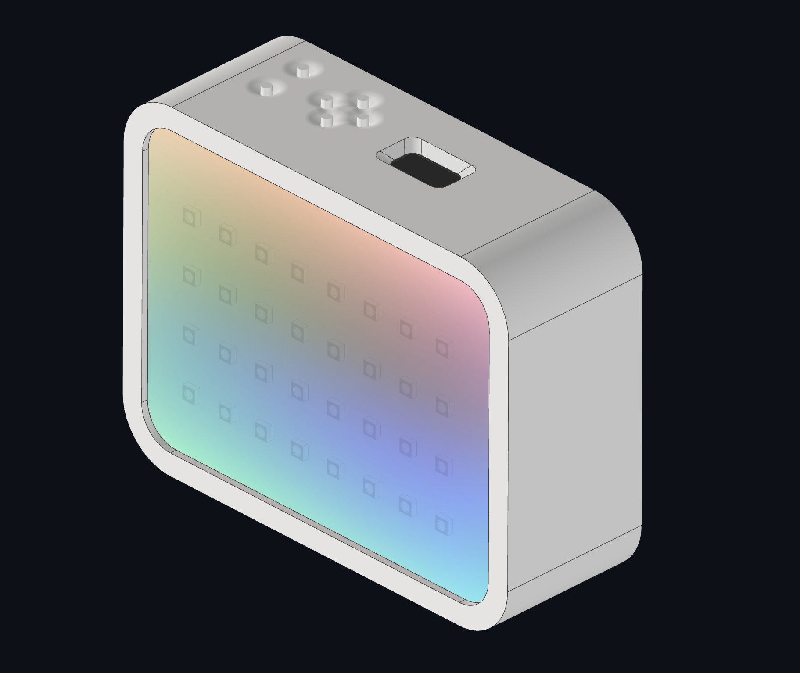

  <ul>
    
<h1 style="display: inline-block;">PICO</h1>

  </ul>

#### Portable Illumination with Customizable Output
###### RGB Camera Lightsource

## Technical Data

|   |   |
|---|---|
|Dimensions|16cm x 12.5cm x 6cm|
|Mounting Options|1x 1/4" UNC Thread|
|Total LEDs|32|
|LED Type|WS2812B-B/W|
|LED Power|Maximum: 7.5W, 2.5W on Average|
|Battery Size|12800mAh|
|Runtime|6h at Max Brightness (White), ~20h at 100% Saturated Colors|
|Battery Type|4x18650 Cells|
|Recharge Time|5h|

